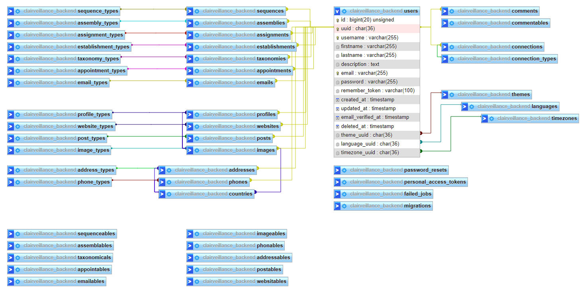

# [Clairveillance Backend](https://github.com/Clairveillance/clairveillance-backend)

This project was generated with [Laravel Installer](https://github.com/laravel/installer) version 4.2.8.

#### Make New Migrations

`php artisan make:migration <name> --path=src/Infrastructure/database/migrations/v1`

#### Run Migrations (with seeders)

`php artisan migrate:fresh --path=src/Infrastructure/database/migrations/v1 --seed`

`php artisan migrate:refresh --path=src/Infrastructure/database/migrations/v1 --seed`

#### Generate [L5-Swagger](https://github.com/DarkaOnLine/L5-Swagger) documentation files

`php artisan l5-swagger:generate`

#### [PHP CS Fixer](https://github.com/eduarguz/shift-php-cs)

`./vendor/bin/php-cs-fixer fix`

_PHP needs to be a minimum version of PHP 7.2.5 and maximum version of PHP 8.0.\*._

`PHP_CS_FIXER_IGNORE_ENV=1 ./vendor/bin/php-cs-fixer fix`

_Running the above command will ignore environment requirements._

#### [PHP Lint](https://github.com/overtrue/phplint)

`./vendor/bin/phplint`

#### [EER Diagram](https://github.com/Clairveillance/clairveillance-backend/blob/master/EER_diagram_003.png)

#### [API Response ('users')](https://github.com/Clairveillance/clairveillance-backend/blob/master/api_users_0043.png)

")
